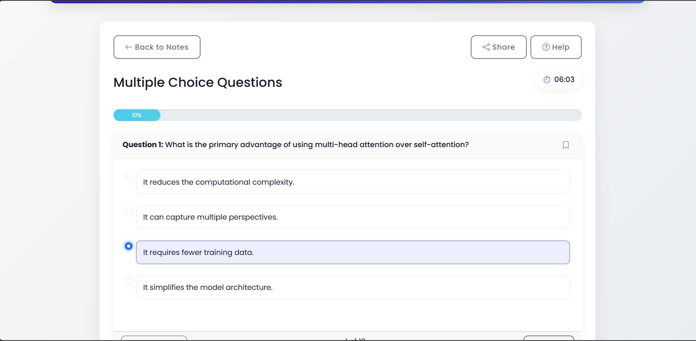

# 🎓 Clip Scholar  
**AI-powered platform that converts YouTube videos into structured learning materials.** 

## Group Members

| Name                    | Email                       |
|-------------------------|-----------------------------|
| Madhan S                | 22bds036@iiitdwd.ac.in      |
| Bharath L               | 22bds013@iiitdwd.ac.in      |
| Gnanesh A R             | 22bds023@iiitdwd.ac.in      |
| Gopal                   | 22bds025@iiitdwd.ac.in      |
| Nachiket Ganesh Apte    | 22bds041@iiitdwd.ac.in      |


## About Clip Scholar  
In today’s digital education landscape, video-based learning is widely used but comes with challenges like time-consuming information retrieval and varying content density.  
**Clip Scholar** addresses these challenges by leveraging **Large Language Models (LLM)** to automatically generate:  
- 📄 **Structured Notes** from video transcripts  
- ❓ **Interactive Quizzes** for self-assessment  
- 🎴 **Flashcards** to reinforce key concepts  

This AI-powered solution enhances accessibility and personalization in learning.  


## Features  
✅ **Transcript Extraction** – Retrieves YouTube video transcripts  
✅ **Notes Generation** – Converts transcripts into well-structured notes  
✅ **Quiz Creation** – Generates MCQs, Fill-in-the-blanks, and Q&A formats  
✅ **Flashcard Development** – Creates flashcards for key concepts  
✅ **User-friendly UI** – Interactive and responsive design for seamless usage  

---

## Project Pipeline
### System Architecture


### Notes Generation Data Flow Diagrams(DFD)


### Flashcards Generation DFD


### Quiz Generation DFD


---

## Tech Stack  
- **Backend**: Python (Flask), [YouTube Transcipt API](https://pypi.org/project/youtube-transcript-api/) or [Supadata](https://supadata.ai/) (For Youtube transcription extraction)
- **AI Model**: [Mistral-Large-2411](https://docs.mistral.ai/getting-started/models/models_overview/) (LLM for text generation tasks)  
- **Frontend**: HTML, CSS, Bootstrap  

## Project Structure
```plaintext
.
├── __pycache__/               # Compiled Python files
├── Templates/                 # Stores frontend HTML templates
│   ├── index.html             # Main UI for Clip Scholar
│   ├── flashcards.html        # Flashcards interaction page
│   └── quiz.html              # Quiz interaction page
├── README.md                  # Project documentation
├── app.py                     # Flask server handling API requests
└── requirements.txt           # Dependencies
```


## Installation & Setup  

### **1️. Clone the Repository**  
```bash
git clone https://github.com/your-username/clip-scholar.git
cd clip-scholar
```

### **2. Generate Mistral API key(free)**  
- Get the Mistral API key from their [website](https://docs.mistral.ai/getting-started/quickstart/).
- Insert the key at line 15. You may add "Bearer API_KEY" instead of just key if it is not working.

### **3. Install the Dependencies**  
```bash
pip install -r requirements.txt
```

### **4. Run the Flask Server**  
```bash
python app.py
```
The application should now be running at [http://127.0.0.1:5000/](http://127.0.0.1:5000/) 


## 📖 Usage Guide
### **1️. Enter the Youtube URL**  
 
### **2. Notes get generated. Next either we can go to Flashcard or QuizGeneration**  
 
### **3. Generate the Flashcards**  
 
 
 
### **4. Generate the Quiz**  
 
 
 
### **5. Automatic Evauation**
 

---
